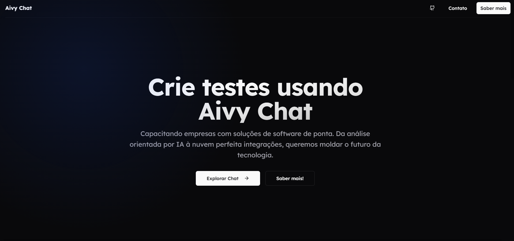

# Aivy Chat



### Tecnologias utilizadas no projeto:

- Next
- React
- Tailwind
- Css
- JavaScript
- TypeScript

## Como contribuir ?

- Clone o projeto em sua máquina, faça as alterações e correções, mas antes de enviar certifique-se de criar uma nova branch em seu nome exemplo: bruno_empke. 

```bash
npm install --force
```
## Rodando o projeto localmente

```bash
npm run dev
```

## Executando o Projeto com Docker

Para configurar e executar o projeto em modo de desenvolvimento com Docker, siga as etapas abaixo:

1. **Instale o Docker**

   Certifique-se de ter o Docker instalado na sua máquina. Consulte a [documentação de instalação](https://docs.docker.com/get-started/get-docker/) para obter instruções detalhadas.

2. **Arquivos de Configuração**

   - O arquivo `dev.Dockerfile` é responsável por empacotar as dependências da aplicação.
   - O arquivo `compose.dev.yml` gerencia o container no modo de desenvolvimento.
   - A configuração presente no arquivo `next.config.js` gerencia a atualização de arquivos para o hot reload no container através de polling, garantindo que o hot reload funcione corretamente também no WSL2.

3. **Inicializando o Projeto**

   Para inicializar o projeto com atualizações automáticas de código (watch mode), execute o comando abaixo:
   ```sh
   docker compose -f compose.dev.yml up --build --watch
   ```
   Este comando irá construir a imagem Docker e iniciar o container, monitorando alterações no código para recarregar automaticamente.
